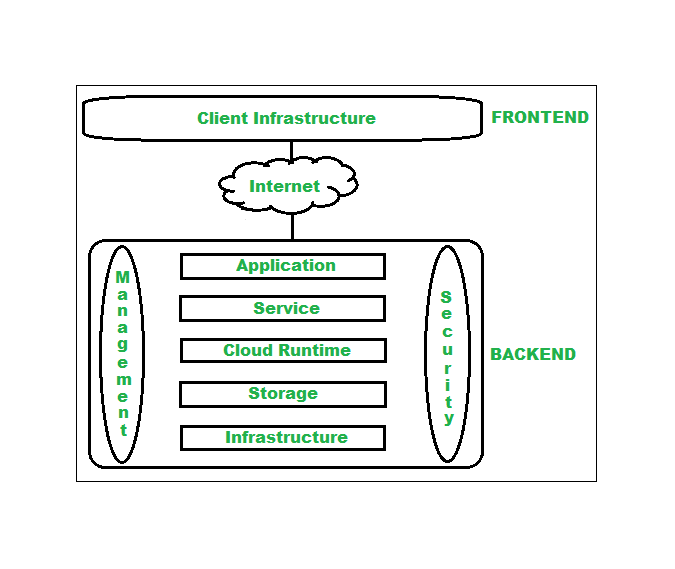

# Unit1

## Q1. Define Cloud Computing & Explain the importance of Cloud Computing?
**What is cloud**
- Cloud computing is the delivery of different services through the Internet, including data storage, servers, databases, networking, and software.
- Cloud storage has grown increasingly popular among individuals who need larger storage space and for businesses seeking an efficient off-site data back-up solution.
- Cloud-based storage makes it possible to save files to a remote database and retrieve them on demand.
- Services can be both public and private—public services are provided online for a fee while private services are hosted on a network to specific clients.
- Cloud security has become an increasingly important field in IT.
**Types of Cloud Services**
Regardless of the kind of service, cloud computing services provide users with a series of functions including:

-   Email
-   Storage, backup, and data retrieval
-   Creating and testing apps
-   Analyzing data
-   Audio and video streaming
-   Delivering software on demand

**Importance:**

**The Importance of Cloud Computing lies in the many Benefits that this process offers:**

**1) Scalability:** Cloud computing allows you to use as many or as few resources as you need. Therefore, depending on your business needs or projected traffic to your business you can choose to increase or decrease your investment in IT infrastructure

**2) Saving Costs:** Cloud computing helps businesses to reduce costs in various ways. Companies only pay for the resources they use, making this process a more economical option than having to buy and manage their own resources. Cloud computing also results in considerable savings in Capital Expenditure and Operating Expenditure because companies do not have to invest in expensive hardware, storage devices, software, etc. 

**3) Disaster Recovery:** With all data stored in the ‘cloud’ backup and recovery of data and applications is quicker and more reliable. This applies to all sizes of organizations and volumes of data. 20% of cloud users claim disaster recovery in four hours or less as opposed to only 9% of non-cloud users. 

**4) Security:** It is the duty and responsibility of the cloud service providers to carefully monitor security. Compare this against an in-house I.T. department, for example, which is tasked with so many internal processes to manage; security is just one of the many items on the list. 

**5) Flexibility:** When using cloud computing the number of options is vast. Depending on the size of the organization, business needs, workloads, etc. companies can choose cloud infrastructure and services accordingly. 

**The Strategic Importance of Cloud Computing lies in the following:**

**1) Accessibility and Increased Collaboration:** Cloud computing allows anyone, anywhere in the world, on any device to access the data stored. You only need an internet connection! What better way to get employees spread across geographical areas to collaborate on projects and assignments? 

**2) Automatic Updates:** Businesses do not have to go through the pain of manually updating and upgrading software and applications. The cloud service provider used usually maintains and updates software regularly.

**3) Increased focus on Core Business:** Given that cloud service providers take care of managing and updating cloud infrastructure, businesses can pay more attention to their business strengths; allowing them to grow and scale their businesses.

**4) Competitiveness:** Cloud computing is a transformational technology that has helped organizations across sectors deliver their products and services in a better way than before. Also, having to spend less time, effort, and money on I.T. resources allows businesses that use cloud computing to pay more attention to the business and respond better to changing market conditions; as opposed to those who haven’t yet understood the importance of cloud computing in business organizations.

## Q2. Explain Cloud System Architecture with suitable diagram?
**Cloud Computing Architecture :**  
The cloud architecture is divided into 2 parts i.e.

1.  Frontend
2.  Backend

Architecture of cloud computing is the combination of both [SOA (Service Oriented Architecture)](https://www.geeksforgeeks.org/service-oriented-architecture/) and EDA (Event Driven Architecture). Client infrastructure, application, service, runtime cloud, storage, infrastructure, management and security all these are the components of cloud computing architecture.

**1. Frontend :**  
Frontend of the cloud architecture refers to the client side of cloud computing system. Means it contains all the user interfaces and applications which are used by the client to access the cloud computing services/resources. For example, use of a web browser to access the cloud platform.

-   **Client Infrastructure –** Client Infrastructure is a part of the frontend component. It contains the applications and user interfaces which are required to access the cloud platform.
-   In other words, it provides a GUI( Graphical User Interface ) to interact with the cloud.

**2. Backend :**   
Backend refers to the cloud itself which is used by the service provider. It contains the resources as well as manages the resources and provides security mechanisms. Along with this, it includes huge storage, virtual applications, virtual machines, traffic control mechanisms, deployment models, etc.

1.  **Application –**  
    Application in backend refers to a software or platform to which client accesses. Means it provides the service in backend as per the client requirement.
2.  **Service –**  
    Service in backend refers to the major three types of cloud based services like [SaaS, PaaS and IaaS](https://www.geeksforgeeks.org/cloud-based-services/). Also manages which type of service the user accesses.
3.   **Runtime Cloud-**  
    Runtime cloud in backend provides the execution and Runtime platform/environment to the Virtual machine.
4.  **Storage –**  
    Storage in backend provides flexible and scalable storage service and management of stored data.
5.  **Infrastructure –**  
    Cloud Infrastructure in backend refers to the hardware and software components of cloud like it includes servers, storage, network devices, virtualization software etc.
6.  **Management –**  
    Management in backend refers to management of backend components like application, service, runtime cloud, storage, infrastructure, and other security mechanisms etc.
7.  **Security –**  
    Security in backend refers to implementation of different security mechanisms in the backend for secure cloud resources, systems, files, and infrastructure to end-users.
8.  **Internet –**  
    Internet connection acts as the medium or a bridge between frontend and backend and establishes the interaction and communication between frontend and backend.
9.  **Database**– Database in backend refers to provide database for storing structured data, such as SQL and NOSQL databases. Example of Databses services include Amazon RDS, Microsoft Azure SQL database and Google CLoud SQL.  
10.  **Networking**– Networking in backend services that provide networking infrastructure for application in the cloud, such as load balancing, DNS and virtual private networks. 
11.  **Analytics**– Analytics in backend service that provides analytics capabillities for data in the cloud, such as warehousing, bussness intellegence and machine learning.

## Q3. Describe the Trends in Cloud Computing?

As more businesses rely on on-demand IT for anything from accounting software to full-fledged IaaS, PaaS, and SaaS solutions, the cloud continues to be a vital resource across multiple industries. Let’s have a look at five of the [cloud computing trends](https://www.veritis.com/blog/the-6-cloud-trends-which-shall-dominate-2022/) you can expect to witness in the future of cloud computing.

**1) The Growth of Serverless Computing**

Serverless computing is a cloud approach in which the customer doesn’t have to deal with infrastructure administration and server provisioning. Instead, the cloud service providers manage the supporting infrastructure and distribute computing power following the demand.

**Serverless computing provides many advantages to a business:**

-   You don’t pay a set price for a certain amount of bandwidth or storage. Instead, you can go with the pay-as-you-go model.
-   The internal team is not responsible for managing the servers.
-   The team can spend more time developing and developing new concepts because internal developers don’t have to provision complicated server clusters.
-   There is no risk of under- or over-provisioning because serverless platforms scale autonomously without any help from the internal staff.

Serverless computing is rapidly growing at a quick pace. Expect to see more businesses use serverless solutions in the upcoming year as it offers yet another way to improve team agility and save costs.

> “According to current predictions, between 2022 and 2026, demand for serverless technologies will increase by 22.6%.”

**2) Even More Adoptions for AI and ML**

All machine learning and [AI platforms](https://www.veritis.com/blog/how-ai-adoption-will-transform-your-business/) need a lot of processing power and data bandwidth, and the cloud is the most cost-effective approach to get these resources. AI and ML technologies complement each other.

-   AI guides **cloud IT services** in managing data while obtaining reliable insights into user behavior, trends, preferences, etc.
-   Cloud computing security increases the affordability and accessibility of AI.

Cloud computing plays a vital role in creating two emerging AI technologies.

**Creative Algorithms:**

These software tools use machine learning to produce everything from artificial data to works of art. These algorithms can also use to train different AI systems.

**Language Modeling:**

Programs that understand human languages more accurately are a technology that is expected to change how companies communicate with their customers.

Cloud computing for business will be crucial in delivering these services to customers and providing the necessary infrastructure for programs with high computational demands.

Not only big companies profit from AI’s usage of cloud network services. Cloud computing service models will become a popular entry point for high-end AI solutions among small and low-tech organizations. Start-ups and businesses with smaller resources could not use advanced ML and AI functionalities without the cloud.

Moreover, **cloud computing service** providers have allowed companies of all sizes and sorts to create AI/ML products. Since these AI/ML platforms demand a lot of processing power and bandwidth, [cloud migration optimization](https://www.veritis.com/infographics/aws-vs-azure-vs-gcp-breakdown-of-cloud-migration-services/) will unavoidably play a significant role in that expansion.

> “Consequently, experts predict that the AI market size will grow to USD 850.61 billion by 2028. “

**3) Deploying to the Edge**

Edge computing is a new method of processing data that doesn’t conduct activities inside a data center. Instead, processing and storing data occurs on specialized hardware at or close to the network’s edge.

**Every edge server has different storage capabilities, networking, and computing, allowing it to perform the following tasks:**

-   Security
-   Network switching and routing
-   Load balancing

In place of cloud computing, edge computing is not a viable alternative. Instead, edge and cloud computing solutions work best together, and this trend is already apparent in 2022.

**Using both cloud and edge technology allows IT environments to benefit from the cloud while also offering:**

-   Reduced bandwidth use
-   Data processing almost instantly
-   Low to no response time lag
-   Reduced data transmission rates

In 2022, edge computing will be crucial as more businesses attempt to boost efficiency by linking edge devices with cloud integration. At least 40% of organizations will look to incorporate Secure Access Service Edge (SASE) into their toolchains so that you can anticipate a rise in SASE as well. With the help of this security architecture, a business may monitor and regulate access to cloud applications and services, on-premises infrastructure, and end-user devices. SASE guides in upholding a high standard of security and compliance, two of the primary issues with edge computing.

**4) Kubernetes and Blockchain**

Kubernetes is a technology that offers a tamper-proof digital ledger that can record data without depending on a centralized authority. Blockchain technology is a game-changer but has scaling issues, particularly massive data management and storage.

A blockchain environment can scale quickly with the help of [Kubernetes (K8s)](https://www.veritis.com/services/kubernetes/), an open-source technology for automating deployments and scaling programs. With several containers running for a single essential service, K8s also offer high availability.

Enterprises will carry on pushing the boundaries of blockchain and K8s in 2022 since they work so well together.

**5) More Focus on Cloud Security**

The main barriers to cloud adoption continue to be issues about compliance, privacy, and integration problems. In response, **cloud service providers** are providing enhanced security features.

**In the feature, we will witness huge demand for:**

**Secure Access Service Edge (SASE):** SASE allows users to stably manage and regulate access across end-user devices, on-premise IT, and cloud apps.

**Cloud-Based Disaster Recovery (DR):** A business can use cloud disaster recovery to back up data and create a standby IT environment that can take over if the primary infrastructure fails.

A primary priority in 2022 will also be gaining visibility across many cloud application platforms. Additionally, business owners desire transparency across all IT environments to close gaps resulting in compliance infringements or cyberattacks.

## Q4. Draw and Explain Cloud Service Model? Iaas paas saas

## Q5. Define Cloud Computing & Describe the Pros and Cons of Cloud Computing?

## Q6. Discuss Cloud Deployment Models with suitable diagram? Public priv hybrid

The cloud deployment model identifies the specific type of cloud environment based on ownership, scale, and access, as well as the cloud’s nature and purpose. It specifies how your cloud infrastructure will look, what you can change, and whether you will be given services or will have to create everything yourself. Relationships between the infrastructure and your users are also defined.
    Different types of cloud computing deployment models are:
	1.  Public cloud 
	2.  Private cloud
	3.  Hybrid cloud
	4.  Community cloud
	5.  Multi-cloud 
	
   **Public Cloud** 
    The public cloud makes it possible for anybody to access systems and services. The public cloud may be less secure as it is open to everyone. The public cloud is one in which cloud infrastructure services are provided over the internet to the general people or major industry groups. The infrastructure in this cloud model is owned by the entity that delivers the cloud services, not by the consumer. It is a type of cloud hosting that allows customers and users to easily access systems and services. This form of cloud computing is an excellent example of cloud hosting, in which service providers supply services to a variety of customers. In this arrangement, storage backup and retrieval services are given for free, as a subscription, or on a per-user basis. Example: Google App Engine etc.
	**Advantages of Public Cloud Model:**
	-   **Minimal Investment:** Because it is a pay-per-use service, there is no substantial upfront fee, making it excellent for enterprises that require immediate access to resources.
	-   **No setup cost:** The entire infrastructure is fully subsidized by the cloud service providers, thus there is no need to set up any hardware.
	-   **Infrastructure Management is not required:** Using the public cloud does not necessitate infrastructure management.
	-   **No maintenance:** The maintenance work is done by the service provider (Not users).
	-   **Dynamic Scalability:** To fulfill your company’s needs, on-demand resources are accessible. 
	**Disadvantages of Public Cloud Model:**
	-   **Less secure:** Public cloud is less secure as resources are public so there is no guarantee of high-level security.
	-   **Low customization:** It is accessed by many public so it can’t be customized according to personal requirements. 
 
   **Private Cloud** 
    The private cloud deployment model is the exact opposite of the public cloud deployment model. It’s a one-on-one environment for a single user (customer). There is no need to share your hardware with anyone else. The distinction between private and public clouds is in how you handle all of the hardware. It is also called the “internal cloud” & it refers to the ability to access systems and services within a given border or organization. The private cloud gives greater flexibility of control over cloud resources.
	**Advantages of Private Cloud Model:**
	-   **Better Control:** You are the sole owner of the property. You gain complete command over service integration, IT operations, policies, and user behavior. 
	-   **Data Security and Privacy:** It’s suitable for storing corporate information to which only authorized staff have access. By segmenting resources within the same infrastructure, improved access and security can be achieved.
	-   **Supports Legacy Systems:** This approach is designed to work with legacy systems that are unable to access the public cloud. 
	-   **Customization:** Unlike a public cloud deployment, a private cloud allows a company to tailor its solution to meet its specific needs.
	**Disadvantages of Private Cloud Model:**
	-   **Less scalable:** Private clouds are scaled within a certain range as there is less number of clients.
	-   **Costly:** Private clouds are more costly as they provide personalized facilities.
	
   **Hybrid Cloud** 
    By bridging the public and private worlds with a layer of proprietary software, hybrid cloud computing gives the best of both worlds. With a hybrid solution, you may host the app in a safe environment while taking advantage of the public cloud’s cost savings. Organizations can move data and applications between different clouds using a combination of two or more cloud deployment methods, depending on their needs. 
	**Advantages of  Hybrid Cloud Model:**
	-   **Flexibility and control:** Businesses with more flexibility can design personalized solutions that meet their particular needs.
	-   **Cost:** Because public clouds provide scalability, you’ll only be responsible for paying for the extra capacity if you require it.
	-   **Security:** Because data is properly separated, the chances of data theft by attackers are considerably reduced. 
	**Disadvantages of Hybrid Cloud Model:**
	-   **Difficult to manage:** Hybrid clouds are difficult to manage as it is a combination of both public and private cloud. So, it is complex.
	-   **Slow data transmission:** Data transmission in the hybrid cloud takes place through the public cloud so latency occurs.
	
   **Community Cloud**
    It allows systems and services to be accessible by a group of organizations. It is a distributed system that is created by integrating the services of different clouds to address the specific needs of a community, industry, or business. The infrastructure of the community could be shared between the organization which has shared concerns or tasks. It is generally managed by a third party or by the combination of one or more organizations in the community. 
	**Advantages of Community Cloud Model:**
	-   **Cost Effective:** It is cost-effective because the cloud is shared by multiple organizations or communities.
	-   **Security:** Community cloud provides better security.
	-   **Shared resources:** It allows you to share resources, infrastructure, etc. with multiple organizations.
	-   **Collaboration and data sharing:** It is suitable for both collaboration and data sharing.
	**Disadvantages of Community Cloud Model:**
	-   **Limited Scalability:** Community cloud is relatively less scalable as many organizations share the same resources according to their collaborative interests. 
	-   **Rigid in customization:** As the data and resources are shared among different organizations according to their mutual interests if an organization wants some changes according to their needs they cannot do so because it will have an impact on other organizations.
      
     

## Q7. Describe Cloud Computing Reference Model with suitable diagram? 

## Q8. Explain Seven-step model of migration into a Cloud?

Seven step migration model:

  
    1.  ASSESSMENT
	Migration starts with an assessment of the issues relating to migration, at the application, code, design, and architecture levels. assessments are also required for tools being used, functionality, test cases, and configuration of the application. The proof of concepts for migration and the corresponding pricing details will help to assess these issues properly.
	 2.  ISOLATE
	The second step is the isolation of all the environmental and systemic dependencies of the enterprise application within the captive data center. These include library, application, and architectural dependencies. This step results in a better understanding of the complexity of the migration.
	3. MAP
	A mapping construct is generated to separate the components that should reside in the captive data center from the ones that will go into the cloud. you should create a mapping of the current IT infrastructure and applications to the cloud. It helps you identify which cloud services and resources you need to use and how to integrate them with your existing systems.
	4. RE-ARCHITECT
	It is likely that a substantial part of the application has to be re-architected and implemented in the cloud. This can affect the functionalities of the application and some of these might be lost. It is possible to approximate lost functionality using cloud runtime support API.
    5. AUGMENT
	The features of cloud computing service are used to augment the application. This step involves adding new cloud services and resources to your existing infrastructure. You can use this step to enhance your systems and applications, add new features, and improve performance.
	6. TEST
	Once the augmentation is done, the application needs to be validated and tested. This is to be done using a test suite for the applications on the cloud. New test cases due to augmentation and proof-of-concepts are also tested at this stage.
	7. OPTIMIZE
	The test results from the last step can be mixed and so require iteration and optimization. It may take several optimizing iterations for the migration to be successful. It is best to iterate through this seven step model as this will ensure the migration to be robust and comprehensive.

## Q9. Describe Cloud Computing Logical Architecture with suitable diagram?

  
  

# Unit 2

## Q10. Explain how the Cloud Data Management Works?
Cloud management refers to the process of managing and optimizing the usage, performance, and cost of cloud-based resources and services. It involves a range of activities that are aimed at ensuring the efficient and effective operation of cloud-based systems and applications. Here's how cloud management works:
1.  Provisioning and Configuration: Cloud management starts with provisioning and configuring the cloud infrastructure, which includes setting up virtual machines, storage, networking, and other resources. This is typically done using cloud management tools and APIs.
2.  Monitoring and Performance Management: Once the cloud infrastructure is set up, it needs to be monitored and managed for optimal performance. This involves tracking metrics such as CPU utilization, network traffic, and storage usage to identify potential issues and ensure that the system is running smoothly. Cloud management tools such as monitoring dashboards and alerts are used to facilitate this process.
3.  Capacity Planning and Scaling: Cloud management also involves capacity planning and scaling, which involves forecasting resource usage and scaling the infrastructure up or down as needed to meet demand. This is typically done using automated scaling and load-balancing tools that can dynamically adjust the capacity of the cloud infrastructure based on changing demand.
4.  Security and Compliance: Cloud management also involves ensuring the security and compliance of the cloud infrastructure and applications. This includes setting up firewalls, access controls, encryption, and other security measures to protect against unauthorized access and data breaches. Compliance regulations such as GDPR and HIPAA must also be adhered to.
5. Cost Management: Cloud management also involves cost management, which involves optimizing the cost of using cloud resources and services. This includes identifying and eliminating wasteful spending, monitoring usage and costs, and implementing cost-saving measures such as reserved instances and spot instances.
6.  Disaster Recovery and Business Continuity: Cloud management also involves disaster recovery and business continuity planning, which involves setting up backup and recovery mechanisms to ensure that data and applications can be restored in the event of a disaster or outage.

## Q11. How the HDFS Architecture works? Explain it with suitable diagram and features?
	 
HDFS/ Hadoop file system is a distributed file system that organizes files and stores their data on a distributed computing software. Its Open source framework lic under Apache v2. Processes large datasets in realtime app. It is a block structured file system where each file is divided in predetermined size blocks and these are stored at cluster of one or many machines. Hadoop is used in retail, healthcare, finance, security,etc. Mapreduce software provides an easy framework for application writing when it comes to handling massive amounts of structured and unstructured data. This is mainly achieved by its facilitation of parallel processing of data.
**Architecture:** 
		 HDFS is composed of master-slave architecture, which includes the following elements:
     1. Namenode:
		NameNode is also known as the master node because it handles all the blocks which are present on DataNodes. NameNode performs the following tasks:
		-   Gives file access to user
		-   Keeps all the records of blocks on DataNode
		-  Manages n records all information of files and modifications.
		-   It takes all the blocks to ensure that all the block are alive 
		-   In case of error, failure, it immediately selects another DataNode to create replication and manage the communication to all the DataNodes
		It contains two types of files FsImage and EditLogs
		**i. FsImage:** file image contains all the information on a filesystem with namespaces. includes all the directories and the files in a serialized manner.
		**ii. EditLogs:** Current modifications done in the files are stored.
     2. Secondary NameNode:
		also called a checkpoint node because it performs regular checkpoints. It acts as a helper for primary NameNode. 
		combines FsImage and EditLogs. 
		It reads all the filesystem information and writes on a hard disk. (R/W operations)
     3. DataNode:
		DataNode is also known as a slave node because it handles every node that contains data on a slave machine. stores data in ext3 or ext4 file format. All data is handled 
		Data node performs the following tasks:
		-   It performs all the operations of files.
		-   It also follows all the instructions given like deleting blocks, creating partnerships, etc.
     4. Backup Node:
		The function of a backup node is similar to a Checkpoint node to perform a checkpointing task. It stores the latest and updated copy of the file system namespace. The Backup node’s function is more precise because save namespace into the local FsImage file and reset editions.
     5. Blocks
		All the data of users are stored in files, which are then divided into small segments. These segments are stored in the DataNodes, where blocks are present. Blocks are mallest continuous loc on harddrive. The default block size of these blocks is 128 MB but can be changed according to req. Also, space is saved for example, If the data is 135 MB, then it will create 2 Blocks. One will be of default size 128 MB, and another will be 7MB only, not 128 MB.
      <big>Features:</big>
       -   **Highly Scalable -** HDFS is highly scalable as it can scale hundreds of nodes in a single cluster.
	-   **Replication -** Due to some unfavorable conditions, the node containing the data may be loss. So, to overcome such problems, HDFS always maintains the copy of data on a different machine.
	-   **Fault tolerance -** In HDFS, the fault tolerance signifies the robustness of the system in the event of failure. The HDFS is highly fault-tolerant that if any machine fails, the other machine containing the copy of that data automatically become active.
	-   **Distributed data storage -** This is one of the most important features of HDFS that makes Hadoop very powerful. Here, data is divided into multiple blocks and stored into nodes.
	-   **Portable -** HDFS is designed in such a way that it can easily portable from platform to another.

## Q12. Explain the features of GFS Architecture?
Google File System (GFS) is a scalable distributed file system created by Google Inc. and   developed to accommodate Google’s expanding data processing requirements. It manages two types of data namely File metadata and File Data. The GFS node cluster consists of a single master and several chunk servers that various client systems regularly access.
	    The master is in charge of managing metadata, including namespace, access control, and mapping data. The master communicates with each chunk server by timed heartbeat messages and keeps track of its status updates.
	 The features of Google file system are as follows:
              - Scalability: 
		      scale horizontally to handle petabytes of data by distributing the data across multiple servers. Thus, storing large amounts of data in the cloud.
	    - High Fault tolerance+ Data Replication:
		     handle server failures and data corruption by replicating the data across multiple servers. Master and chunk servers can be restarted in a few seconds and with such a fast recovery. it reduces the risk of data loss. shadow master handles.
	    - High performance: 
		      optimized for large sequential reads and writes, which makes it ideal for storing large files such as videos, images, audio. supports concurrent reads and writes, for multiple users to access the same data simultaneously.
	    - Data locality:
		      store data on the same server where it is being processed, which reduces network latency and improves performance. useful for distributed applications that require high-performance data access.
	    - Snapshots:
		      enables users to create a copy of the file system at a specific point in time. This feature is useful for backup and disaster recovery purposes.
	    - Data compression: 
		     enables users to store more data in less space. useful for storing large files such as video and audio.
	     -  Load balancing: The master server also monitors the cluster as a whole and periodically rebalances the workload by shifting chunks from one chunkserver to another.
	     - Excessive Throughput: many nodes operate concurrently.
	     - Reduced client and master interaction because of large chunk server size.
	     - Namespace management and locking.
	     - Data integrity
	     - High availability
	     - Support large scale processing workloads on commodity hardware

## Q13. Describe Data Intensive Technologies for Cloud Computing?

## Q14. Explain the Storage Area Network with suitable diagram? SAN

## Q15. Describe Cloud Datastores with suitable examples?

## Q16. How does the Grid Computing Works in view of Data Storage? Explain it with suitable diagram.

## Q17. Interpret the usage of Network Attached Storage(NAS)
NAS stands for network-attached storage, It has shared storage on a local area network. A network-attached storage (NAS) server is a storage device that consists of a high-performance file server that connects to a LAN. A NAS server is a specialized appliance designed to serve, store, serve, and retrieve files. So here this article gives the advantages and disadvantages of NAS to better understand this topic.
	 Advantages of NAS:
		-   Relatively inexpensive
		-   A self-contained solution
		-   Ease of administration 
		-   It is multi-protocol
		-   A wide array of system and size to choose from
		-   Drive failure tolerant storage volumes
		-   Automatic backup to other devices and the cloud.
		-   Easy to install and configure
		-   24/7 and remote data availability
		-   More flexible than DAS
		-   It requires some knowledge of computer network to use them efficiently
		-   Universal client access
		-   With NAS you will get the same speed of data transfer as DAS that is faster
		-   The user who wants their data processed directly because will need to do it through installed OS

## Q18. Identify the advantage and disadvantageous of Direct Attached Storage(DAS)
Direct Attached Storage (DAS) is a type of storage architecture where storage devices such as hard drives or solid-state drives are directly connected to a server or workstation, cannot be accesed by other computers. DAS can be used in a variety of applications, including backup and recovery, file storage, and data warehousing. It has 2 types:
	 - Internal DAS: the storage device is internally connected to the server/host via medium. The connection is serial or parallel bus.
	 - External DAS: the external storage device is directly linked to the server without any additional devices.

***Advantages of Direct Attached Storage:**
1.  Simple Setup: DAS is easy to set up and manage. All you need to do is connect the storage device to the server or workstation, and it is ready to use. There is no need for complicated network configurations, which can save time and resources.    
2.  Low Latency: DAS has low latency because it is directly connected to the server or workstation. This means that data can be accessed quickly, which can be beneficial for applications that require fast data access.    
3.  High Performance: DAS can deliver high performance, especially with solid-state drives. This makes it an ideal solution for applications that require high-speed data access, such as video editing or database management.    
4.  Low Cost: DAS is often less expensive than other storage solutions because there are no additional components or hardware required. This can make it a cost-effective option for small businesses or individual users. Initial cost is less.
**Disadvantages of Direct Attached Storage:**		
1.  Limited Scalability: DAS is limited in terms of scalability because it is directly connected to a single server or workstation. Thus it may not be the best option for organizations that require large amounts of storage or have high scalability needs.
2.  Limited Redundancy: DAS provides limited redundancy because it is directly connected to a single server or workstation. If the server or workstation fails, the data stored on the DAS device may be lost or inaccessible.
3.  Limited Accessibility: DAS is limited in terms of accessibility because it is directly connected to a single server or workstation. This means that it may not be the best option for organizations that require remote access or multi-user access.
4.  Limited Backup and Recovery: DAS provides limited backup and recovery options because it is directly connected to a single server or workstation. This means that it may not be the best option for organizations that require frequent backups or need to recover data quickly in case of a disaster.
