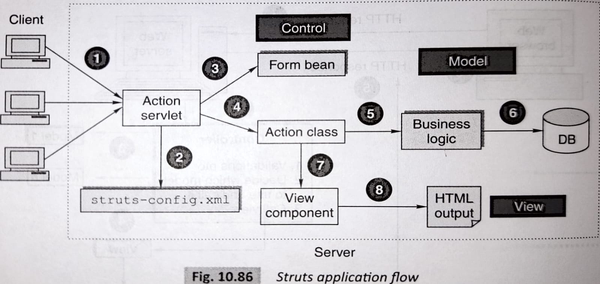

**Unit III Java Servlets and XML**
- [x] Servlet:
    - [x] Servlet architecture overview
    - [x] A “Hello World” servlet
    - [x] Servlets generating dynamic content
    - [x] Servlet life cycle
    - [x] parameter data
    - [x] sessions
    - [x] cookies
    - [x] URL rewriting 
    - [ ] other Servlet capabilities
    - [ ] data storage
    - [ ] Servlets concurrency
    - [ ] databases (MySQL) and Java Servlets
- [x] XML:
    - [x] XML documents and vocabularies
    - [x] XML declaration
    - [x] XML Namespaces
    - [x] DOM based XML processing
    - [x] transforming XML documents
    - [x] DTD:
        - [x] Schema
        - [x] elements
        - [x] attributes
- [x] AJAX:
    - [x] Introduction
    - [x] Working of AJAX
  
Unit IV JSP and Web Services
- [ ] JSP:
    - [x] Introduction to Java Server Pages
    - [x] JSP and Servlets
    - [ ] running JSP applications
    - [x] Basic JSP
    - [ ] JavaBeans classes and JSP
    - [ ] Support for the Model-view-controller paradigm
    - [ ] JSP related technologies
- [ ] Web Services:
    - [ ] Web Service concepts
    - [ ] Writing a Java Web Service
    - [ ] Writing a Java web service client
    - [ ] Describing Web Services: WSDL
    - [ ] Communicating Object data: SOAP
- [ ] Struts:
    - [ ] Overview
    - [ ] architecture
    - [ ] configuration
    - [ ] actions
    - [ ] interceptors
    - [ ] result types
    - [ ] validations
    - [ ] localization
    - [ ] exception handling
    - [ ] annotations
  
Unit V Server Side Scripting Languages
- [ ] PHP:
    - [x] Introduction to PHP
    - [x] uses of PHP
    - [x] general syntactic characteristics
    - [x] Primitives
    - [x] operations and expressions
    - [x] output
    - [x] control statements
    - [x] arrays
    - [ ] functions
    - [ ] pattern matching
    - [x] form handling
    - [ ] files
    - [x] cookies
    - [x] session tracking
    - [x] using MySQL with PHP
    - [ ] WAP and WML
- [ ] Introduction to ASP.NET:
    - [ ] Overview of the .NET Framework
    - [ ] Overview of C#
    - [ ] Introduction to ASP.NET
    - [ ] ASP.NET Controls
    - [ ] Web Services
- [x] Overview of Node JS
  
Unit VI Ruby and Rails
- [ ] Introduction to Ruby:
    - [ ] Origins & uses of Ruby
    - [ ] scalar types and their operations
    - [ ] simple input and output
    - [ ] control statements
    - [ ] fundamentals of arrays
    - [ ] hashes
    - [ ] methods
    - [ ] classes
    - [ ] code blocks and iterators
    - [ ] pattern matching
- [ ] Introduction to Rails:
    - [ ] Overview of Rails
    - [ ] Document Requests
    - [ ] Processing Forms
    - [ ] Rails Applications and Databases
    - [ ] Layouts
    - [x] Rails with Ajax
- [x] Introduction to EJB

pyq
servlet lifecycle
hello world code servlet 
explain cookies & session 
xml schema 
internal external dtd
xslt example
diff xml & xslt
xml transforming 
client vs server 
dtd full topic
servlet architecture 
jsp architecture 
jsp lifecycle 
ajax
servlet vs jsp
jsp code
xmlhttp req object 
include directive
include actions
jsp implicit objs(atleast 5)
jsp all
webservices
uddi
soap
rest
MVC
struts 
struts.xml
web.xml
config files 
data tags struts 
interceptors 
localization 


### Compare `doGet()` and `doPost()` methods in servlet.

1. Purpose:
    
    - `doGet()`: This method is used to handle HTTP GET requests.
    - `doPost()`: This method is used to handle HTTP POST requests.
2. HTTP Verb:
    
    - `doGet()`: Corresponds to the HTTP GET verb.
    - `doPost()`: Corresponds to the HTTP POST verb.
3. Parameters:
    
    - `doGet()`: Parameters are part of the URL query string.
    - `doPost()`: Parameters are sent in the request body.
4. Data length:
    
    - `doGet()`: Limited by the maximum length of the URL.
    - `doPost()`: Not limited by the URL length, can handle larger data sets.
5. Security:
    
    - `doGet()`: Parameters are visible in the URL.
    - `doPost()`: Parameters are not visible in the URL, more secure for sensitive data.
6. Caching:
    
    - `doGet()`: GET requests can be cached by browsers or intermediate caching servers.
    - `doPost()`: POST requests are not cached by default.
7. Usage:
    
    - `doGet()`: Typically used for retrieving data or performing read-only operations.
    - `doPost()`: Typically used for submitting forms, creating new resources, or modifying data.

### Process of transforming XML document.

The process of transforming an XML document involves using an XML transformation language, such as XSLT, to convert the XML document into another format or structure. Here are the steps involved:

1. Define the Transformation Logic:
    
    - Create an XSLT stylesheet that defines the transformation rules.
2. Load the XML Document and XSLT Stylesheet:
    
    - Load the source XML document.
    - Load the XSLT stylesheet.
3. Create a Transformer:
    
    - Create an instance of a transformer object.
4. Set Transformation Parameters (Optional):
    
    - Set any required parameters on the transformer object.
5. Perform the Transformation:
    
    - Call the `transform()` method on the transformer object.
6. Handle the Transformed Output:
    
    - Save the transformed output to a file, send it as a response, or process it further.

### HTTP session

An HTTP session is a mechanism used to maintain stateful communication between a web server and a web client over a series of HTTP requests and responses. It allows the server to recognize and remember individual clients and their associated data.

Here's an overview of how an HTTP session works:

1. Session Creation:
    
    - When a client initiates a request, the server creates a unique session for that client.
    - The server generates a unique session identifier, typically stored in a cookie or URL.
2. Session Tracking:
    
    - The client includes the session ID in each request.
    - The server uses the session ID to track the client and retrieve session data.
3. Server-Side Data Storage:
    
    - The server maintains a data structure (session store) to store session-related data.
4. Accessing Session Data:
    
    - On each request, the server retrieves the session ID from the client.
    - The server accesses the corresponding session data from the session store.
5. Session Expiry and Inactivity Timeout:
    
    - Sessions have an expiration time or inactivity timeout.
    - Expired sessions are removed from the session store.
6. Session Termination:
    
    - The client can delete the session cookie or stop including the session ID.
    - The server can invalidate the session programmatically or based on certain conditions.

### Explain XML with respect to structure, declaration syntax, and namespace.

XML (eXtensible Markup Language) is a markup language designed to store and transport structured data. It provides a way to describe and organize data in a hierarchical format, making it suitable for a wide range of applications.

Structure:

- XML documents consist of text-based data organized hierarchically using elements.
- Elements are enclosed within start and end tags.
- Elements can contain other elements, forming a tree-like structure.
- Elements can have attributes associated with them.

Declaration Syntax:

- XML documents begin with an optional XML declaration.
- The declaration specifies the XML version and encoding.
- The declaration is enclosed within `<?xml ... ?>` tags.

Namespace:

- XML namespaces are used to avoid naming conflicts between elements and attributes.
- Namespaces are declared using a prefix and a URI.
- The prefix is a shorthand alias for the namespace.
- The namespace declaration is usually placed in the root element.

Example of an XML document with structure, declaration, and namespace:

```xml
<?xml version="1.0" encoding="UTF-8"?>
	<rootElement xmlns:prefix="http://www.example.com/namespace">
		<prefix:element attribute="value">
			<subElement>Text content</subElement>
		</prefix:element> 
	</rootElement>`
```


By leveraging XML's structure, declaration syntax, and namespace support, you can create well-organized and semantically meaningful documents for data exchange and processing.

### Explain the Struts architecture with a neat diagram and also explain the benefits of Struts.




The Struts framework follows the Model-View-Controller (MVC) architectural pattern and provides a structured approach to application development. The key components of the Struts architecture are:

1. Controller (ActionServlet):
    
    - Central controller that receives and processes incoming HTTP requests.
    - Delegates requests to appropriate Action classes.
2. Action:
    
    - Encapsulates the business logic for processing requests.
    - Handles incoming requests, performs processing, and prepares data for the view.
3. ActionForm:
    
    - Represents the data submitted by the user or required for processing.
    - Validates user input and transfers data between the view and the Action.
4. Model (Business Logic):
    
    - Represents the business logic or services required for processing requests.
    - Performs data processing, calculations, and interacts with external systems.
5. View (JSP):
    
    - Renders the user interface and presents data to the user.
    - Typically uses JSP pages for generating dynamic content.
6. Struts Tag Library:
    
    - Provides custom tags for form handling, input validation, and data presentation.

Benefits of Struts:

1. MVC Architecture: Struts enforces separation of concerns and promotes code organization, modularity, and maintainability.
    
2. Reusability and Extensibility: Struts components can be easily extended or customized, promoting code reusability.
    
3. Simplified Form Handling: Struts simplifies form handling, automatically populating data, performing validation, and providing error handling.
    
4. Built-in Request Processing: Struts provides a request processing pipeline, handling parameter parsing and error handling.
    
5. Integration with Other Technologies: Struts integrates well with Hibernate, Spring, Tiles, and other technologies, leveraging their benefits.
    
6. Community and Ecosystem: Struts has a large community with extensive documentation and resources, providing support and knowledge sharing.
    

Overall, Struts offers a structured approach to web application development, promoting code organization, reusability, and maintainability. It simplifies development and provides a robust foundation for building applications.

## EJB (Enterprise JavaBeans)

EJB stands for Enterprise JavaBeans, which is a server-side component model for building distributed, scalable, and transactional enterprise applications in Java. EJB provides a framework for developing reusable and portable business components that can be deployed on any EJB-compliant application server.

There are three types of EJBs:

1. Session Beans: Session beans are the most common type of EJB and are used to encapsulate business logic and represent an individual client's interaction with the application. They can be stateless or stateful.
    
    - Stateless Session Beans: These beans do not maintain conversational state for a specific client. They are suitable for implementing stateless services or performing independent operations on behalf of clients.
        
    - Stateful Session Beans: Stateful session beans maintain conversational state for a specific client across multiple method invocations. They are useful when the client needs to maintain stateful information or context throughout a series of method calls.
        
2. Entity Beans: Entity beans represent persistent data and are used for data storage and retrieval. They are typically used to model data from a database. In the latest versions of EJB, the use of entity beans has been deprecated in favor of other persistence frameworks like Java Persistence API (JPA) or Object-Relational Mapping (ORM) tools such as Hibernate.
    
3. Message-Driven Beans: Message-driven beans (MDBs) provide a way to asynchronously process messages from a messaging system. They are used in Java Message Service (JMS) environments to handle the processing of messages. MDBs are often used in scenarios where decoupling the sender and receiver is required, such as event-driven architectures or message-driven systems.
    

These EJB types provide different functionalities and are designed to address various aspects of enterprise application development, such as business logic encapsulation, data persistence, and asynchronous messaging.

## Rails with AJAX

Ruby on Rails (Rails) is a web application framework that follows the Model-View-Controller (MVC) architectural pattern. AJAX (Asynchronous JavaScript and XML) is a technique that allows web applications to update parts of a page without reloading the entire page.

When Rails is combined with AJAX, it enables developers to create more interactive and responsive web applications. With AJAX, Rails applications can send asynchronous requests to the server and update specific portions of a webpage dynamically, providing a smoother user experience.

Rails provides built-in support for AJAX through its JavaScript libraries like Prototype and jQuery. These libraries simplify the process of making AJAX requests and handling responses. Rails also includes features like unobtrusive JavaScript, which separates JavaScript code from HTML markup, making it easier to maintain and update.

By leveraging AJAX in Rails, developers can implement features such as live search, auto-complete, infinite scrolling, real-time updates, and form submissions without page reloads. This improves the overall user experience by reducing waiting times and providing instant feedback.

## WAP and WML

WAP (Wireless Application Protocol) is a standardized technology for accessing information and services on wireless devices, such as mobile phones, through the use of the internet. WAP defines a set of protocols and specifications for enabling wireless communication and data transfer.

WML (Wireless Markup Language) is a markup language specifically designed for creating content for mobile devices within the WAP framework. It is similar to HTML but optimized for smaller screens and limited bandwidth.

WML is used to create mobile-specific websites or applications that can be accessed by WAP-enabled devices. It allows developers to structure content, define navigation, and present information in a format suitable for mobile devices. WML supports basic user interface components, including text, images, links, forms, and menus.

However, it's important to note that WAP and WML have become less popular in recent years, as advancements in mobile technologies have led to the dominance of smartphones and the adoption of more capable web technologies like HTML5, CSS, and JavaScript. Modern mobile websites and applications are now primarily built using responsive web design techniques to ensure compatibility with various screen sizes and devices.

## Positive Aspects of Rails

Ruby on Rails (Rails) offers several positive aspects for developers. Here are nine key advantages of Rails along with examples:

1. Convention over Configuration: Rails follows the principle of "convention over configuration," reducing the need for explicit configuration. For example, Rails automatically maps URLs to controller actions, simplifying the routing setup.
    
2. DRY (Don't Repeat Yourself): Rails emphasizes code reusability and provides features like partials and helpers. For instance, defining a shared navigation menu as a partial avoids duplicating the code across multiple views.
    
3. MVC Architecture: Rails follows the Model-View-Controller architectural pattern, promoting separation of concerns and code organization. Models handle data and business logic, views handle presentation, and controllers manage interactions between models and views.
    
4. Rapid Development: Rails focuses on productivity and provides tools like scaffolding for quickly generating code. This allows developers to build prototypes or initial versions of applications rapidly.
    
5. ActiveRecord: Rails incorporates the ActiveRecord ORM for simplified database interactions. It provides an intuitive interface for querying and manipulating databases using Ruby methods. For example, `User.where(name: "John")` finds all users named "John" without writing SQL queries manually.
    
6. Testing Frameworks: Rails provides robust testing frameworks like RSpec and Minitest, promoting automated testing and code reliability. Tests help ensure application stability. With RSpec, expressive and readable tests can be written to cover different functionality aspects.
    
7. Gems and Libraries: Rails has a vast ecosystem of gems and libraries contributed by the community, offering ready-to-use solutions for common tasks. For instance, the Devise gem provides user authentication and registration functionality.
    
8. Community and Documentation: Rails has a large and active community that provides support, resources, and documentation. Online forums, mailing lists, and Stack Overflow are some examples of resources available to Rails developers.
    
9. Scalability: Rails applications can scale effectively using features like caching, background job processing, and integration with various deployment solutions. Caching mechanisms reduce database queries and improve performance.
    

These positive aspects of Rails contribute to its popularity and make it a preferred choice for web application development, enabling developers to build robust, maintainable, and scalable applications efficiently.

## Object-Oriented Way to Connect MySQL Database with PHP

To connect to a MySQL database using an object-oriented approach in PHP, you can use the MySQLi (MySQL Improved) extension or the PDO (PHP Data Objects) extension. Here's an explanation of both approaches:

1. MySQLi Extension (Object-oriented style):

```php
$host = 'localhost';
$username = 'your_username';
$password = 'your_password';
$database = 'your_database';

// Create a new MySQLi instance
$mysqli = new mysqli($host, $username, $password, $database);

// Check for connection errors
if ($mysqli->connect_errno) {
   die('Failed to connect to MySQL: ' . $mysqli->connect_error);
}

// Perform database operations
$query = "SELECT * FROM users";
$result = $mysqli->query($query);

// Fetch results
while ($row = $result->fetch_assoc()) {
   // Process each row
   echo $row['username'] . '<br>';
}

// Close the database connection
$mysqli->close();

```


2. PDO Extension (Object-oriented style):

```php
$host = 'localhost';
$username = 'your_username';
$password = 'your_password';
$database = 'your_database';

// Create a new PDO instance
$dsn = "mysql:host=$host;dbname=$database;charset=utf8mb4";
$pdo = new PDO($dsn, $username, $password);

// Set PDO attributes
$pdo->setAttribute(PDO::ATTR_ERRMODE, PDO::ERRMODE_EXCEPTION);
$pdo->setAttribute(PDO::ATTR_DEFAULT_FETCH_MODE, PDO::FETCH_ASSOC);

// Perform database operations
$query = "SELECT * FROM users";
$stmt = $pdo->query($query);

// Fetch results
while ($row = $stmt->fetch()) {
   // Process each row
   echo $row['username'] . '<br>';
}

// Close the database connection
$pdo = null;

```


Both approaches provide a flexible and object-oriented way to connect to a MySQL database in PHP. You can choose the approach that best fits your needs and coding style. Remember to handle errors, sanitize user input, and follow security best practices to ensure the safety of your database interactions.

## PHP Concepts

### Arrays

In PHP, arrays are versatile data structures that can store multiple values in a single variable. They allow you to group related data together and access them using keys or indexes. There are two main types of arrays in PHP:

1. Indexed Arrays: Indexed arrays store values with numeric keys, starting from 0 and incrementing by 1 for each subsequent element. You can access elements in an indexed array using their corresponding indexes.
    
    Example:
```php
$fruits = array("Apple", "Banana", "Orange");
echo $fruits[0];  // Output: Apple
echo $fruits[1];  // Output: Banana
echo $fruits[2];  // Output: Orange

```
    
2. Associative Arrays: Associative arrays use custom keys (strings or integers) to access their values instead of numeric indexes. You can access elements in an associative array using their corresponding keys.
    
    Example:
```php
 $student = array(
    "name" => "John",
    "age" => 20,
    "grade" => "A"
);
echo $student["name"];   // Output: John
echo $student["age"];    // Output: 20
echo $student["grade"];  // Output: A
   
```
    

Arrays in PHP can also be multidimensional, meaning they can contain other arrays as their elements.

### Functions

Functions in PHP are blocks of reusable code that perform specific tasks. They allow you to encapsulate a set of instructions and call them multiple times throughout a program. You can define a function using the `function` keyword followed by the function name and a pair of parentheses. Any required parameters are listed inside the parentheses.

Example:

```php
function greet($name) {
    echo "Hello, $name!";
}

greet("John");  // Output: Hello, John!

```

Functions can also have return values using the `return` statement. These values can be assigned to variables or used directly in expressions.

Example:

```php
function multiply($a, $b) {
    return $a * $b;
}

$result = multiply(5, 3);
echo $result;  // Output: 15

```

### Control Statements

Control statements in PHP allow you to control the flow of execution in your code based on specific conditions or loops.

1. Conditional Statements:
    - `if` statement: Executes a block of code if a specified condition is true.
    - `else` statement: Executes a block of code if the condition of the previous `if` statement is false.
    - `elseif` statement: Allows you to check multiple conditions sequentially.
    - `switch` statement: Evaluates an expression and executes different blocks of code based on different cases.

Example:

```php
$grade = 85;

if ($grade >= 90) {
    echo "Excellent!";
} elseif ($grade >= 80) {
    echo "Good!";
} else {
    echo "Keep it up!";
}
```

2. Looping Statements:
    - `while` loop: Repeats a block of code while a specified condition is true.
    - `do-while` loop: Repeats a block of code at least once and continues as long as a specified condition is true.
    - `for` loop: Repeats a block of code a specified number of times.
    - `foreach` loop: Iterates over elements in an array or an object.

Example:

```php
$numbers = array(1, 2, 3, 4, 5);

foreach ($numbers as $number) {
    echo $number . " ";
}

// Output: 1 2 3 4 5

```

These control statements allow you to make decisions, repeat code execution, and handle different scenarios in your PHP programs.

By utilizing arrays, functions, and control statements, you can efficiently handle and manipulate data, create reusable code blocks, and control the flow of your PHP programs.

## .NET Framework with CLR and CLI:

The .NET Framework is a software development platform developed by Microsoft. It provides a comprehensive set of libraries, tools, and runtime environment for building and running various types of applications, including web applications, desktop applications, and mobile apps. At the core of the .NET Framework are two important components: the Common Language Runtime (CLR) and the Common Language Infrastructure (CLI).

Here's a diagram illustrating the relationship between the .NET Framework, CLR, and CLI:

```
+--------------------------+
|                          |
|    .NET Framework        |
|                          |
| +---------------------+  |
| |   Common Language   |  |
| |     Runtime (CLR)   |  |
| +---------------------+  |
| |   Common Language   |  |
| | Infrastructure (CLI)|  |
| +---------------------+  |
|                          |
+--------------------------+

```

Let's explain the components:

1. **Common Language Runtime (CLR)**:
    
    - The CLR is the execution engine of the .NET Framework. It provides the necessary runtime environment to execute managed code written in languages such as C#, VB.NET, and F#.
    - The CLR performs various tasks, including memory management (automatic garbage collection), code verification, compilation (just-in-time compilation), and exception handling.
    - It provides a common type system (CTS) that enables interoperability between different .NET languages by ensuring consistent data types and behavior.
2. **Common Language Infrastructure (CLI)**:
    
    - The CLI is a specification that defines the execution environment and runtime services for executing programs written in languages that adhere to the CLI standard, such as C# and VB.NET.
    - It defines the rules and standards for language compilers, runtime environments, and libraries to ensure cross-language interoperability and portability.
    - The CLI includes specifications for the Common Intermediate Language (CIL), which is an intermediate language that is compiled from source code and executed by the CLR.
    - It also specifies metadata formats that describe the structure and behavior of types, allowing for reflection and dynamic loading of types at runtime.

Together, the CLR and CLI provide a powerful and consistent runtime environment for executing managed code in the .NET Framework. They enable developers to write applications in multiple languages, promote code interoperability, and provide features like memory management and exception handling. The .NET Framework extends beyond the CLR and CLI to provide additional libraries, frameworks, and tools that simplify application development and enhance productivity.

### Explain the benefits of web services and explain SOAP, REST, and UDDI

- Explanation: Web services provide a standardized way for different software applications to communicate and exchange data over the internet. They offer several benefits, including:
	
	- **Interoperability**: Web services enable communication between applications developed using different programming languages and running on different platforms. This promotes interoperability and allows systems to work together seamlessly.
		
	- **Reusability**: Web services promote code reusability by encapsulating functionality and exposing it as services. Applications can leverage these services without reinventing the wheel, saving development time and effort.
		
	- **Scalability**: Web services can handle high loads and scale horizontally by adding more servers or instances. This makes them suitable for applications with varying levels of traffic and allows for seamless expansion.
		
	- **Loose Coupling**: Web services promote loose coupling between applications. Each service operates independently, and changes in one service do not affect others as long as the interface remains consistent. This enhances flexibility and ease of maintenance.
		
	- **Platform Independence**: Web services are platform-independent. They use standard protocols and data formats that can be understood by any client or server application, regardless of the underlying technology stack.
		
	- **SOAP (Simple Object Access Protocol)**: SOAP is a protocol for exchanging structured information in web services using XML. It defines a set of rules for message format, communication, and security. SOAP-based web services follow a strict contract-based approach with a predefined WSDL (Web Services Description Language) document.
		
	- **REST (Representational State Transfer)**: REST is an architectural style that emphasizes a stateless, client-server communication model. RESTful web services use standard HTTP methods (GET, POST, PUT, DELETE) to perform operations on resources. They leverage the existing web infrastructure and are typically lightweight and easy to implement.
		
	- **UDDI (Universal Description, Discovery, and Integration)**: UDDI is a directory service that allows businesses to publish and discover web services. It provides a central registry where service providers can advertise their services, and consumers can search for and locate relevant services.

## Scalar Types and Operations in Ruby:

Ruby has several scalar types, which are data types that represent a single value. Here are some commonly used scalar types in Ruby:

1. **Integer**: Represents whole numbers without decimal points. Example: `5`, `-10`, `1000`.
    
2. **Float**: Represents numbers with decimal points. Example: `3.14`, `-0.5`, `1.0`.
    
3. **String**: Represents a sequence of characters. Example: `"Hello"`, `'Ruby'`, `"123"`.
    
4. **Boolean**: Represents either `true` or `false`. Used in logical operations and conditional statements.
    
5. **Symbol**: Represents a unique identifier. Example: `:name`, `:status`, `:user_id`.
    
6. **Nil**: Represents the absence of a value. Example: `nil`, `null`.
    

These scalar types support various operations in Ruby. Here are some common operations:

- Arithmetic Operations: Addition (`+`), Subtraction (`-`), Multiplication (`*`), Division (`/`), Modulo (`%`).
- String Operations: Concatenation (`+`), Substring (`[]`), Length (`length` or `size`).
- Comparison Operations: Equal to (`==`), Not equal to (`!=`), Greater than (`>`), Less than (`<`), Greater than or equal to (`>=`), Less than or equal to (`<=`).
- Logical Operations: AND (`&&`), OR (`||`), NOT (`!`).
- Type Conversion: Converting between different scalar types using methods like `to_i`, `to_f`, `to_s`, etc.

These scalar types and operations in Ruby provide flexibility and versatility in handling various kinds of data and performing computations.